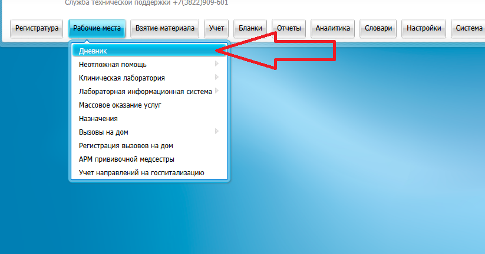
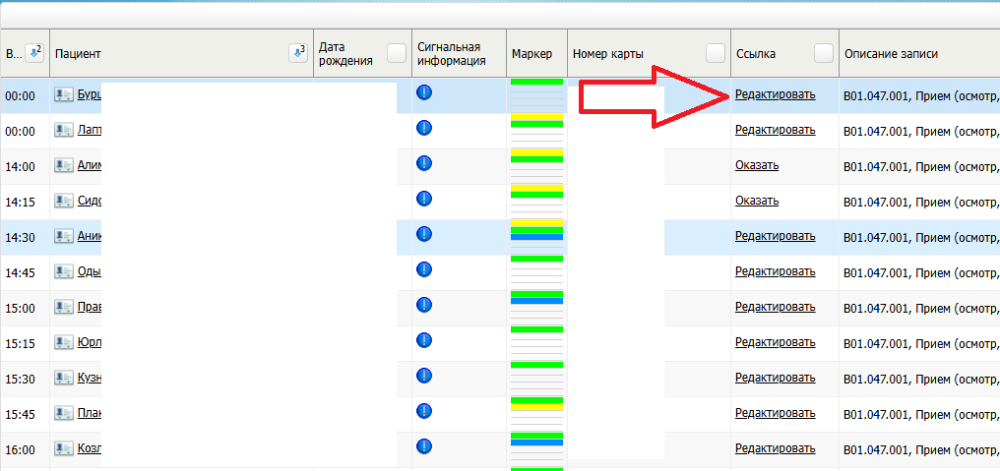
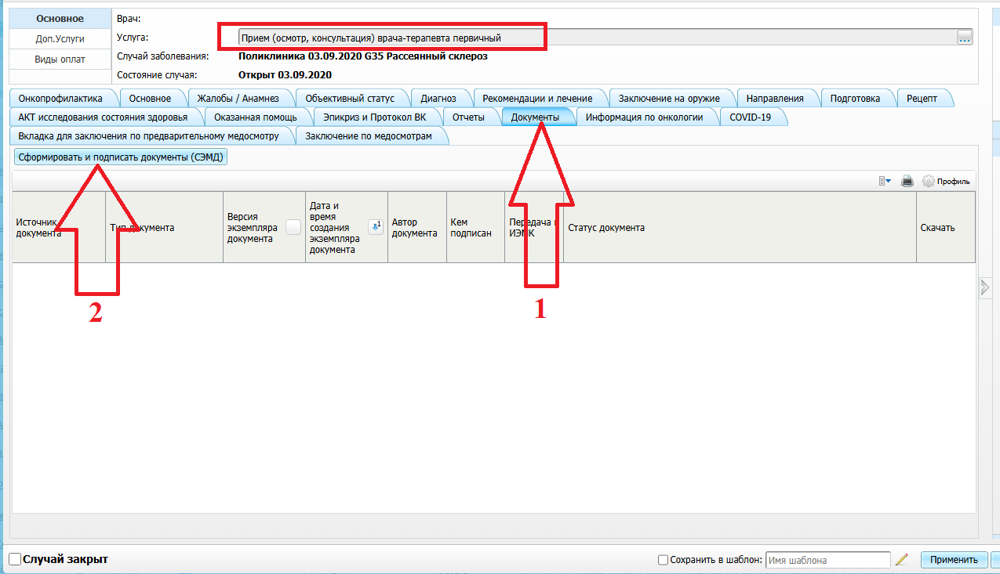
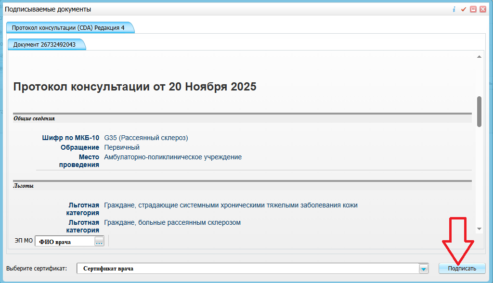

# СЭМД «Протокол консультации»

## 📝 Пошаговая инструкция

1. **Авторизация и навигация**  
   Авторизуйтесь в системе МИС ТО под учетной записью врача, ведущего консультационные приёмы.  
   Перейдите по пути: `Рабочие места` → `Дневник`.
   

2. **Работа с записью приёма**  
   - Если приём ещё **не оказан**, его необходимо сначала оказать (сохранить).  
   - Если приём уже сохранён, нажмите кнопку **«Редактировать»**.
   

3. **Формирование документов**  
   Перейдите на вкладку **«Документы»** и нажмите кнопку **«Сформировать и подписать документы (СЭМД)»**.
   

4. **Проверка и подписание**  
   > [!warning] Важно!
   > В открывшемся окне внимательно проверьте выбранные сертификаты электронной подписи. **ФИО и должность** должны строго соответствовать врачу, который выполняет подписание.  
   
   Если все данные верны, нажмите кнопку **«Подписать»**.
   
   